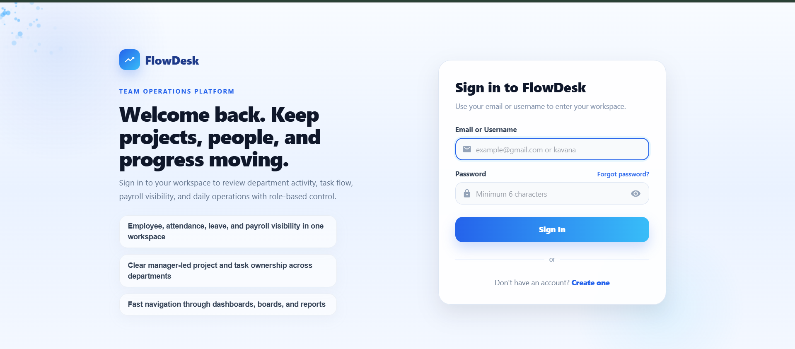
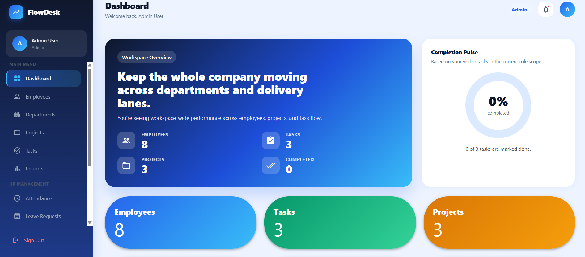
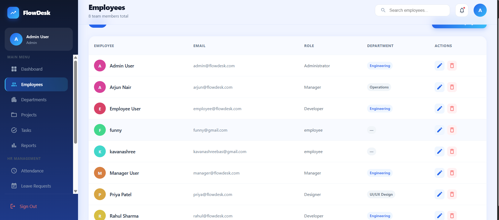
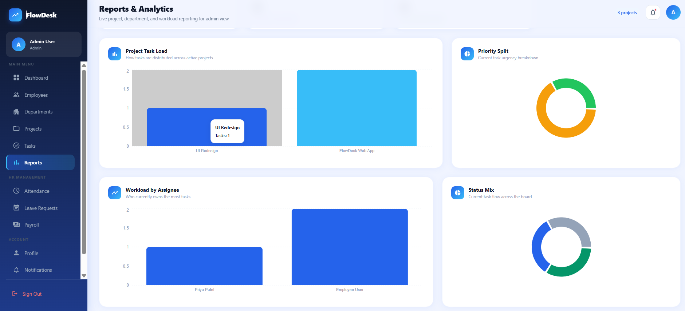
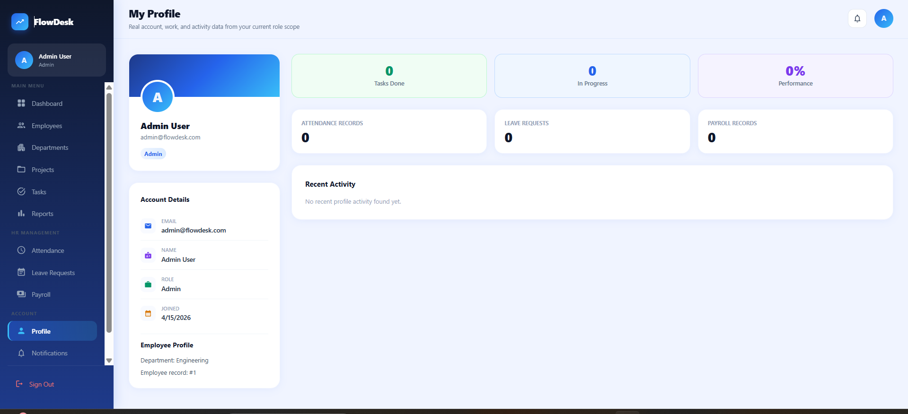

<div align="center">

# ⚡ FlowDesk
### *Enterprise Operations & Workforce Management Platform*

[](https://flowdesk-mhufzs6ly-sahithi8.vercel.app)
[](https://flowdesk-backend-yoi9.onrender.com)
[](https://aiven.io)

<p align="center">
  <b>A full-stack enterprise workforce portal enabling real-time task management, role-based workflows, attendance tracking, and administrative controls.</b>
</p>

[View Live Demo](https://flowdesk-mhufzs6ly-sahithi8.vercel.app) · [Report Bug](https://github.com/202451125/FlowDesk/issues) · [Request Feature](https://github.com/202451125/FlowDesk/issues)

</div>

---

## 📸 Application Preview & Screenshots

<div align="center">

### 🔑 Authentication & Portal Overview
| Authentication / Login Portal | Main Dashboard View |
| :---: | :---: |
|  |  |

---

### 📊 Operations & Workforce Management
| Task Management | Employee Directory | Leave Approval Portal |
| :---: | :---: | :---: |
|  |  |  |

</div>

---

## 🚀 Key Features

* **🔐 Multi-Role Access Control:** Custom workflows and navigation paths for **Admin**, **Manager**, and **Employee** roles.
* **🛡️ Secure Authentication:** Password hashing using `Werkzeug` security standards with session persistence.
* **📋 Task & Project Tracking:** Assign, update, and monitor project timelines and individual task deliverables in real time.
* **📅 Leave & Attendance Management:** Integrated submission and approval engine for employee leave requests.
* **⚡ High-Performance Database:** Configured MySQL connection pooling (`mysql.connector.pooling`) to handle concurrent database queries with minimal latency.
* **🌐 Production Architecture:** Decoupled multi-tier setup hosted on **Vercel** (Frontend), **Render** (Backend API), and **Aiven** (Cloud MySQL).

---

## 🛠️ Tech Stack

### **Frontend**
* **Framework:** React.js (built with Vite)
* **Styling:** Tailwind CSS / Material-UI
* **HTTP Client:** Axios
* **Icons:** Lucide-React / Material Icons

### **Backend**
* **Framework:** Flask (Python)
* **WSGI Server:** Gunicorn
* **Security & Auth:** Werkzeug
* **Environment:** Python-Dotenv

### **Database & Infrastructure**
* **Database:** Cloud MySQL (Aiven)
* **Deployment:** Vercel (Frontend CI/CD) + Render (Backend Web Service)
* **Version Control:** Git & GitHub

---

## 📐 System Architecture

```text
┌────────────────────────────────┐         ┌────────────────────────────────┐
│   React Frontend (Vite App)    │ ──────> │    Flask REST API (Render)     │
│  [https://flowdesk...vercel.app](https://flowdesk...vercel.app)  │  HTTP   │ [https://flowdesk...onrender.app](https://flowdesk...onrender.app)│
└────────────────────────────────┘ Requests └────────────────────────────────┘
                                                           │
                                                           │ MySQL Connection
                                                           │ Pool (SSL Required)
                                                           ▼
                                            ┌──────────────────────────────┐
                                            │  Cloud MySQL Database (Aiven)│
                                            │   Port 28097 / defaultdb     │
                                            └──────────────────────────────┘